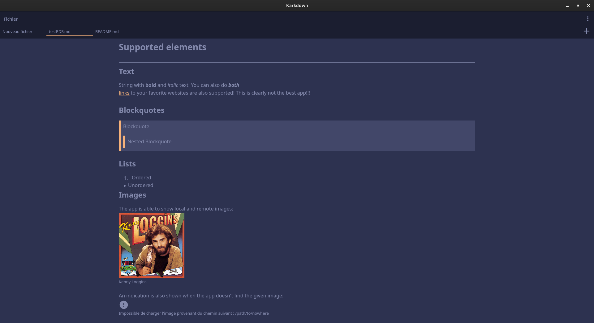

# Karkdown

A software for editing markdown files.
## Features
- Create and edit multiple files
- Rendering of markdown elements are done while editing the file for a better view of the final result
- PDF export (does not work with images currently)
## Supported markdown elements
Karkdown actually supports the following markdown elements:
- headers
- ordered and unordered lists (without multiple indentations)
- **bold**, *italic* and ***both at the same time*** text
- ~~strikethrough~~ text
- [links](https://github.com/enteraname74) to your favorites websites
- images (both local and remote images can be rendered)
- some kind of `basic code block`
- blockquotes
- horizontal rules
## Examples

